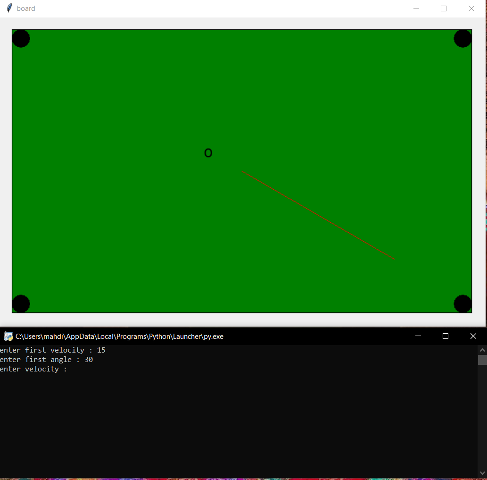

<h3 align="center">Biliard-Physics</h3>

  a simple biliard game with only one ball!

 

<!-- ABOUT THE PROJECT -->
## About The Project
  the most important goal of this project was to implement real physics when we hit a ball in a biliard table.
   
   
  

  <table>
    <tr>
      <td align="center">
        
      </td>
    </tr>
  </table>

## About The Code
#### libraries
&ensp; tkinter for graphics
 
&ensp; math for applying physics to the game
 
#### logic
&ensp;  in terminal velocity and angle are gotten (the velocity unit is cm/80ms because our board is updated each 80 ms 
 
&ensp;  and the angle start from left to right) and the position of the ball is updated every 80 ms based on the input
 
&ensp; velocity and angle in drowO function, after that the velocity is updated based on either it is just moving on
 
&ensp; the board or is hit by the table edges.

## more info
if you like to know more about the formula follow this link to read more in my medium blog
<!-- put link here -->

